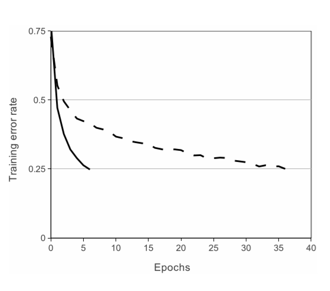
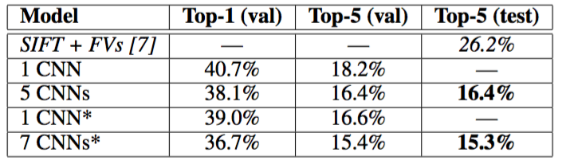

# AlexNet

## Abstract

本文模型在2010的ImageNet LSVRC比赛数据集上取得了第一，top-1：37.5%，top-5：15.3%，远远超过第二名的top-5：26.2%。

AlexNet由5个卷积模块（包含了池化）、3个全连接、1个1000-way Softmax组成，使用非饱和神经元并在GPU上训练，同时为了减少过拟合，还采用了一种当时刚出现的正则化方法dropout。

## 1 Introduction

当时的目标识别为提高性能，常采用增大数据集、更好的model、更好的正则化技术阻止过拟合。

为了从ImageNet的数百万张高分辨的图像中学习到几千个对象，提出了CNNs（Convolutional nerual networks），其具有统计上的稳定性，并且对像素有局部性的依赖（卷积直接导致）。与相同层次的前馈相比，CNNs具有更少的连接和参数，更易于训练，但是理论最优性能稍差于前馈。

论文几个贡献：

1. 在ILSVRC-2010和ILSVRC-2012[2]的ImageNet子集上训练了到目前为止最大的神经网络之一，并取得了迄今为止在这些数据集上报道过的最好结果；
2. 编写了高度优化的2D卷积GPU实现以及训练卷积神经网络内部的所有其它操作；
3. 使用了一些有效的技术来防止过拟合；
4. CNNs的深度很重要，移除任何卷积层（每个卷积层包含的参数不超过模型参数的1%）都会导致更差的性能。

网络尺寸主要受限于目前GPU的内存容量和能忍受的训练时间。CNNs在两个GTX 580 3GB GPU上训练五六天。所有实验表明结果可以简单地通过等待更快的GPU和更大的可用数据集来提高。

## 2 The Dataset

ImageNet数据集有超过1500万的标注高分辨率图像，这些图像属于大约22000个类别。这些图像是从网上收集的，使用了Amazon's Mechanical Turk的众包工具通过人工标注的。从2010年起，作为Pascal视觉对象挑战赛的一部分，每年都会举办ImageNet大规模视觉识别挑战赛（ILSVRC）。ILSVRC使用ImageNet的一个子集，1000个类别每个类别大约1000张图像。总计，大约120万训练图像，50000张验证图像和15万测试图像。

ILSVRC-2010是ILSVRC竞赛中唯一可以获得测试集标签的版本，因此大多数实验都是在这个版本上运行的。由于模型参加了ILSVRC-2012竞赛，因此在之后包含模型在这个版本的数据集上的结果，这个版本的测试标签是不可获得的。在ImageNet上，按照惯例报告两个错误率：top-1和top-5，top-5错误率是指测试图像的正确标签不在模型认为的五个最可能的便签之中。

mageNet包含各种分辨率的图像，而CNNs要求输入固定维度。因此将图像进行下采样到固定的`256×256`分辨率。除了在训练集上对像素减去平均活跃度外，不对图像做任何其它的预处理。因此将在原始的RGB像素值上训练网络。

> 下采样步骤：给定一个矩形图像，首先缩放图像短边长度为256，然后从结果图像中裁剪中心的`256×256`大小的图像块。

## 3 The Architecture

下面内容是按照重要性排序的，3.1最重要。

### 3.1 ReLU Nonlinearity

下面的实验证明：使用饱和的激活函数（如Tanh）慢于非饱和的激活函数（如ReLU），且ReLU能较明显的加快训练速度。

> 右饱和：
> 当x趋向于正无穷时，函数的导数趋近于0，此时称为右饱和。
>
> 左饱和：
> 当x趋向于负无穷时，函数的导数趋近于0，此时称为左饱和。
>
> 饱和函数和非饱和函数：
> 当一个函数既满足右饱和，又满足左饱和，则称为饱和函数，否则称为非饱和函数。
>
> 常用的饱和激活函数和非饱和激活函数：
> 饱和激活函数有如Sigmoid和tanh，非饱和激活函数有ReLU；相较于饱和激活函数，非饱和激活函数可以解决“梯度消失”的问题，加快收敛。
>
> 采用ReLU的深度卷积神经网络训练时间比等价的Tanh单元要快几倍，对于一个特定的四层卷积网络，在CIFAR-10数据集上达到25%的训练误差所需要的迭代次数可以证实这一点。

> 使用ReLU的四层卷积神经网络在CIFAR-10数据集上达到25%的训练误差比使用tanh神经元的等价网络（虚线）快六倍。为了使训练尽可能快，每个网络的学习率是单独选择的，且没有采用任何类型的正则化。这里展示的效果的大小随网络结构的变化而变化，但使用ReLU的网络都比等价的饱和神经元快几倍。

### 3.2 Training on Multiple GPUs

（该部分就是在说怎样用GPU训练的，略）

> CNN架构图解，明确描述了两个GPU之间的责任。在图的顶部，一个GPU运行在部分层上，而在图的底部，另一个GPU运行在部分层上。GPU只在特定的层进行通信。网络的输入是150,528维，网络剩下层的神经元数目分别是253,440–186,624–64,896–64,896–43,264–4096–4096–1000（8层）。

### 3.3 Local Response Normalization

局部响应归一化有助于泛化。$a^i_{x,y}$表示激活的神经元，通过在$(x,y)$位置应用核$i$，然后应用ReLU计算。响应归一化激活$b^i_{x,y}$通过下式定义：
$$
b^i_{x,y}=a^i_{x,y}/(k+α\sum_{j=max(0,i−n/2)}^{min(N−1,i+n/2)}(a^i_{x,y})^2)^β
$$
求和运算在$n$个“毗邻的”核映射的同一位置上执行，$N$是本层的卷积核数目。核映射的顺序当然是任意的，在训练开始前确定。响应归一化的顺序实现了一种侧抑制形式，灵感来自于真实神经元中发现的类型，为使用不同核进行神经元输出计算的较大活动创造了竞争。常量$k$，$n$，$α$，$β$是超参数，它们的值通过验证集确定。在本文中，设$k=2$，$n=5$，$α=0.0001$，$β=0.75$。在特定的层使用的ReLU非线性之后应用了这种归一化。

这个方案与Jarrett等人[11]的局部对比度归一化方案有一定的相似性，但更恰当的称其为“亮度归一化”，因此没有减去均值。响应归一化分别减少了top-1：1.4%，top-5：1.2%的错误率。之后在CIFAR-10数据集上验证了这个方案的有效性：一个四层CNN取得了13%的错误率，而使用归一化取得了11%的错误率。

>Local Response Normalization(LRN)，局部响应归一化层。
>
>首先要引入一个神经生物学的概念：**侧抑制（lateral inhibitio），即指被激活的神经元抑制相邻的神经元。**归一化（normaliazation）的目的就是**“抑制”**，LRN就是借鉴这种侧抑制来实现局部抑制，尤其是我们使用RELU的时候，这种“侧抑制”很有效 ，因而在alexnet里使用有较好的效果。
>
>LRN的好处？
>
>**1.归一化有助于快速收敛；
>2.对局部神经元的活动创建竞争机制，使得其中响应比较大的值变得相对更大，并抑制其他反馈较小的神经元，增强了模型的泛化能力。**

### 3.4 Overlapping Pooling

CNN中的池化层归纳了同一核映射上相邻组神经元的输出。习惯上，相邻池化单元归纳的区域是不重叠的（例如[17, 11, 4]）。更确切的说，池化层可看作由池化单元网格组成，网格间距为$s$个像素，每个网格归纳池化单元中心位置$z\times z$大小的邻居。如果设置$s=z$，会得到通常在CNN中采用的传统局部池化。如果设置$s<z$，会得到重叠池化。这就是本文网络中使用的方法，设置$s=2$，$z=3$。这个方案分别降低了top-1：0.4%，top-5：0.3%的错误率，与非重叠方案$s=2$，$z=2$相比，输出的维度是相等的。在训练过程中通常观察采用重叠池化的模型，发现它更难过拟合。

> 其实就是MaxPooling。

### 3.5 Overall Architecture

如图2所示，网络包含8个带权重的层，前5层是卷积层，剩下的3层是全连接层。最后一层全连接层的输出是1000维softmax的输入，softmax会产生1000类标签的分布。训练以最大化多项逻辑回归为目标，目标函数等价于最大化预测分布下训练样本正确标签的对数概率的均值。

第2，4，5卷积层的核只与位于同一GPU上的前一层的核映射相连接（见图2）。第3卷积层的核与第2层的所有核映射相连。全连接层的神经元与前一层的所有神经元相连。第1，2卷积层之后是响应归一化层。3.4节描述的这种最大池化层在响应归一化层和第5卷积层之后。ReLU应用在每个卷积层和全连接层的输出上。

第1卷积层使用96个核对224 × 224 × 3的输入图像进行滤波，核大小为11 × 11 × 3，步长是4个像素（核映射中相邻神经元感受野中心之间的距离）。第2卷积层使用第1卷积层的输出（响应归一化和池化）作为输入，并使用256个核进行滤波，核大小为5 × 5 × 48。第3，4，5卷积层互相连接，中间没有接入池化层或归一化层。第3卷积层有384个核，核大小为3 × 3 × 256，与第2卷积层的输出（归一化的，池化的）相连。第4卷积层有384个核，核大小为3 × 3 × 192，第5卷积层有256个核，核大小为3 × 3 × 192。每个全连接层有4096个神经元。

## 4 Reducing Overfitting

### 4.1 Data Augmentation

图像数据上最简单常用的用来减少过拟合的方法是使用标签保留变换（例如[25, 4, 5]）来人工增大数据集。这里使用了两种独特的数据增强方式，这两种方式都可以从原始图像通过非常少的计算量产生变换的图像。在本文的实现中，变换图像通过CPU的Python代码生成，而此时GPU正在训练前一批图像。

一种数据增强方式包括产生图像变换和水平翻转。先从256×256图像上通过随机提取224 × 224的图像块，然后在这些提取的图像块上进行训练。这使训练集的规模增加了2048倍，当然，由此产生的训练实例是高度相互依赖的。没有这个方案，网络会有大量的过拟合。在测试时，网络会提取5个224 × 224的图像块（四个角上的图像块和中心的图像块）和它们的水平翻转（因此总共10个图像块）进行预测，然后对网络在10个图像块上的softmax层进行平均。

第二种数据增强方式包括改变训练图像的RGB通道的强度。具体地，在整个ImageNet训练集上对RGB像素值集合执行PCA。对于每幅训练图像，加上多倍找到的主成分，大小成正比的对应特征值乘以一个随机变量，随机变量通过均值为0，标准差为0.1的高斯分布得到。因此对于每幅RGB图像像素$I_{x}y=[I^R_{xy},I^G_{xy},I^B_{xy}]^T$，加上下面的数量：
$$
[p_1,p_2,p_3][\alpha_1\lambda_1,\alpha_2\lambda_2,\alpha_3\lambda_3]^T
$$
$p_i$，$λ_i$分别是RGB像素值3 × 3协方差矩阵的第$i$个特征向量和特征值，$α_i$是前面提到的随机变量。对于某个训练图像的所有像素，每个$α_i$只获取一次，直到图像进行下一次训练时才重新获取。这个方案近似抓住了自然图像的一个重要特性，即光照的颜色和强度发生变化时，目标身份是不变的。这个方案减少了TOP- 1错误率1%以上。

### 4.2 Dropout

Dropout（失活）[10]，它会以0.5的概率对每个隐层神经元的输出设为0。那些“失活的”的神经元不再进行前向传播并且不参与反向传播。因此每次输入时，神经网络会采样一个不同的架构，但所有架构共享权重。这个技术减少了复杂的神经元互适应，因为一个神经元不能依赖特定的其它神经元的存在。因此，神经元被强迫学习更鲁棒的特征，它在与许多不同的其它神经元的随机子集结合时是有用的。在测试时，我们使用所有的神经元但它们的输出乘以0.5，对指数级的许多失活网络的预测分布进行几何平均，这是一种合理的近似。

在图2中的前两个全连接层使用失活。如果没有失活，网络表现出大量的过拟合。失活大致上使要求收敛的迭代次数翻了一倍。

## 5 Details of learning

使用的optimizer是SGD，momentum：0.9，weight_decay：0.0005. BatchSize：128.

权重初始化采用高斯分布初始化，均值为0，标准差为0.01。对于偏置初始化，仅对第2，4，5卷积层和全连接隐层将神经元偏置初始化为常量1，剩下的层将神经元偏置初始化为0。

对所有的层采取相同LR，同时采用了LR衰减，当验证误差在当前的学习率下停止降低时，遵循启发式的方法将学习率除以10。最初学习率初始化为0.01，在训练停止之前降低了三次。在120万图像的训练集上训练神经网络大约90个epoch，在两个NVIDIA GTX 580 3GB GPU上花费了五到六天。

## 6 Results

在ILSVRC-2010上的结果概括为表1。本文网络取得了top-1：37.5%，top-5：17.0%的错误率。

ILSVRC-2010竞赛中最佳结果（竞赛top1）是top-1：47.1%，top-5：28.2%，使用的方法是对6个在不同特征上训练的稀疏编码模型生成的预测采取平均融合。从那时起已公布的最好结果是top-1 ：45.7%，top-5：25.7%，使用的方法是平均在Fisher向量（FV）上训练的两个分类器的预测结果，Fisher向量是通过两种密集采样特征计算得到的[24]。（后续成果）

> ILSVRC-2010测试集上的结果对比。斜体是其它人取得的最好结果。

本文模型参加了ILSVRC-2012竞赛并在表2概括了结果。

*由于ILSVRC-2012的测试集标签不可以公开得到，我们不能报告我们尝试的所有模型的测试错误率。在这段的其余部分，我们会使用验证误差率和测试误差率互换，因为在我们的实验中它们的差别不会超过0.1%*.

本文中描述的单一CNN取得了top-5：18.2%的错误率。五个类似的CNN预测的平均误差率为16.4%。为了对ImageNet 2011秋季发布的整个数据集（1500万图像，22000个类别）进行分类，在最后的池化层之后有一个额外的第6卷积层，训练了一个CNN，然后在它上面进行finetune，在ILSVRC-2012取得了16.6%的错误率。对在ImageNet 2011秋季发布的整个数据集上预训练的两个CNN和前面提到的五个CNN的预测进行平均得到了15.3%的错误率。第二名的最好竞赛输入取得了26.2%的错误率，他的方法是对FV上训练的一些分类器的预测结果进行平均，FV在不同类型密集采样特征计算得到的。

> ILSVRC-2012验证集和测试集的误差对比。斜线部分是其它人取得的最好的结果。带星号的是“预训练的”对ImageNet 2011秋季数据集进行分类的模型。更多细节请看第六节。

最后，还包括在ImageNet 2009秋季数据集上的误差率，ImageNet 2009秋季数据集有10,184个类，890万图像。在这个数据集上按照惯例用一半的图像来训练，一半的图像来测试。由于没有建立测试集，数据集分割有必要不同于以前作者的数据集分割，但这对结果没有明显的影响。在这个数据集上的的top-1和top-5错误率是67.4%和40.9%，使用的是上面描述的在最后的池化层之后有一个额外的第6卷积层网络。这个数据集上公开可获得的最好结果是78.1%和60.9%[19]。

### 6.1 Qualitative Evaluations

图3显示了网络的两个数据连接层学习到的卷积核。网络学习到了大量的频率核、方向选择核，也学到了各种颜色点。注意两个GPU表现出的专业化，3.5小节中描述的受限连接的结果。GPU 1上的核主要是没有颜色的，而GPU 2上的核主要是针对颜色的。这种专业化在每次运行时都会发生，并且是与任何特别的随机权重初始化（以GPU的重新编号为模）无关的。

> 第一卷积层在224×224×3的输入图像上学习到的大小为11×11×3的96个卷积核。上面的48个核是在GPU 1上学习到的而下面的48个卷积核是在GPU 2上学习到的。更多细节请看6.1小节。

在图4的左边部分，是通过在8张测试图像上计算它的top-5预测定性地评估了网络学习到的东西。注意即使是不在图像中心的目标也能被网络识别，例如左上角的小虫。大多数的top-5标签似乎是合理的。例如，对于美洲豹来说，只有其它类型的猫被认为是看似合理的标签。在某些案例（格栅，樱桃）中，网络在意的图片焦点真的很含糊。

> （左）8张ILSVRC-2010测试图像和我们的模型认为最可能的5个标签。每张图像的下面是它的正确标签，正确标签的概率用红条表示（如果正确标签在top 5中）。（右）第一列是5张ILSVRC-2010测试图像。剩下的列展示了6张训练图像，这些图像在最后的隐藏层的特征向量与测试图像的特征向量有最小的欧氏距离。

探索网络可视化知识的另一种方式是思考最后的4096维隐藏层在图像上得到的特征激活。如果两幅图像生成的特征激活向量之间有较小的欧式距离，我们可以认为神经网络的更高层特征认为它们是相似的。图4表明根据这个度量标准，测试集的5张图像和训练集的6张图像中的每一张都是最相似的。注意在像素级别，检索到的训练图像与第一列的查询图像在L2上通常是不接近的。

## 7 Discussion

本文结果表明一个大型深度卷积神经网络在一个具有高度挑战性的数据集上使用纯有监督学习可以取得破纪录的结果。值得注意的是，如果移除一个卷积层，网络性能会降低。例如，移除任何中间层都会引起网络损失大约2%的top-1性能。因此深度对于实现我们的结果非常重要。

## References

> [1] R.M.BellandY.Koren.Lessonsfromthenetflixprizechallenge.ACMSIGKDDExplorationsNewsletter, 9(2):75–79, 2007.
>
> [2] A. Berg, J. Deng, and L. Fei-Fei. Large scale visual recognition challenge 2010. [www.imagenet.org/challenges](http://www.imagenet.org/challenges). 2010.
>
> [3] L. Breiman. Random forests. Machine learning, 45(1):5–32, 2001.
>
> [4] D. Cires ̧an, U. Meier, and J. Schmidhuber. Multi-column deep neural networks for image classification. Arxiv preprint arXiv:1202.2745, 2012.
>
> [5] D.C. Cires ̧an, U. Meier, J. Masci, L.M. Gambardella, and J. Schmidhuber. High-performance neural networks for visual object classification. Arxiv preprint arXiv:1102.0183, 2011.
>
> [6] J. Deng, W. Dong, R. Socher, L.-J. Li, K. Li, and L. Fei-Fei. ImageNet: A Large-Scale Hierarchical Image Database. In CVPR09, 2009.
>
> [7] J. Deng, A. Berg, S. Satheesh, H. Su, A. Khosla, and L. Fei-Fei. ILSVRC-2012, 2012. URL http://www.image-net.org/challenges/LSVRC/2012/.
>
> [8] L. Fei-Fei, R. Fergus, and P. Perona. Learning generative visual models from few training examples: An incremental bayesian approach tested on 101 object categories. Computer Vision and Image Understanding, 106(1):59–70, 2007.
>
> [9] G. Griffin, A. Holub, and P. Perona. Caltech-256 object category dataset. Technical Report 7694, California Institute of Technology, 2007. URL http://authors.library.caltech.edu/7694.
>
> [10] G.E. Hinton, N. Srivastava, A. Krizhevsky, I. Sutskever, and R.R. Salakhutdinov. Improving neural networks by preventing co-adaptation of feature detectors. arXiv preprint arXiv:1207.0580, 2012.
>
> [11] K. Jarrett, K. Kavukcuoglu, M. A. Ranzato, and Y. LeCun. What is the best multi-stage architecture for object recognition? In International Conference on Computer Vision, pages 2146–2153. IEEE, 2009.
>
> [12] A. Krizhevsky. Learning multiple layers of features from tiny images. Master’s thesis, Department of Computer Science, University of Toronto, 2009.
>
> [13] A. Krizhevsky. Convolutional deep belief networks on cifar-10. Unpublished manuscript, 2010.
>
> [14] A. Krizhevsky and G.E. Hinton. Using very deep autoencoders for content-based image retrieval. In ESANN, 2011.
>
> [15] Y. Le Cun, B. Boser, J.S. Denker, D. Henderson, R.E. Howard, W. Hubbard, L.D. Jackel, et al. Handwritten digit recognition with a back-propagation network. In Advances in neural information processing systems, 1990.
>
> [16] Y. LeCun, F.J. Huang, and L. Bottou. Learning methods for generic object recognition with invariance to pose and lighting. In Computer Vision and Pattern Recognition, 2004. CVPR 2004. Proceedings of the 2004 IEEE Computer Society Conference on, volume 2, pages II–97. IEEE, 2004.
>
> [17] Y. LeCun, K. Kavukcuoglu, and C. Farabet. Convolutional networks and applications in vision. In Circuits and Systems (ISCAS), Proceedings of 2010 IEEE International Symposium on, pages 253–256. IEEE, 2010.
>
> [18] H. Lee, R. Grosse, R. Ranganath, and A.Y. Ng. Convolutional deep belief networks for scalable unsupervised learning of hierarchical representations. In Proceedings of the 26th Annual International Conference on Machine Learning, pages 609–616. ACM, 2009.
>
> [19] T. Mensink, J. Verbeek, F. Perronnin, and G. Csurka. Metric Learning for Large Scale Image Classification: Generalizing to New Classes at Near-Zero Cost. In ECCV - European Conference on Computer Vision, Florence, Italy, October 2012.
>
> [20] V. Nair and G. E. Hinton. Rectified linear units improve restricted boltzmann machines. In Proc. 27th International Conference on Machine Learning, 2010.
>
> [21] N. Pinto, D.D. Cox, and J.J. DiCarlo. Why is real-world visual object recognition hard? PLoS computational biology, 4(1):e27, 2008.
>
> [22] N. Pinto, D. Doukhan, J.J. DiCarlo, and D.D. Cox. A high-throughput screening approach to discovering good forms of biologically inspired visual representation. PLoS computational biology, 5(11):e1000579,2009.
>
> [23] B.C. Russell, A. Torralba, K.P. Murphy, and W.T. Freeman. Labelme: a database and web-based tool for image annotation. International journal of computer vision, 77(1):157–173, 2008.
>
> [24] J.SánchezandF.Perronnin.High-dimensionalsignaturecompressionforlarge-scaleimageclassification. In Computer Vision and Pattern Recognition (CVPR), 2011 IEEE Conference on, pages 1665–1672. IEEE,2011.
>
> [25] P.Y. Simard, D. Steinkraus, and J.C. Platt. Best practices for convolutional neural networks applied to visual document analysis. In Proceedings of the Seventh International Conference on Document Analysis and Recognition, volume 2, pages 958–962, 2003.
>
> [26] S.C.Turaga,J.F.Murray,V.Jain,F.Roth,M.Helmstaedter,K.Briggman,W.Denk,andH.S.Seung.Convolutional networks can learn to generate affinity graphs for image segmentation. Neural Computation, 22(2):511–538, 2010.

